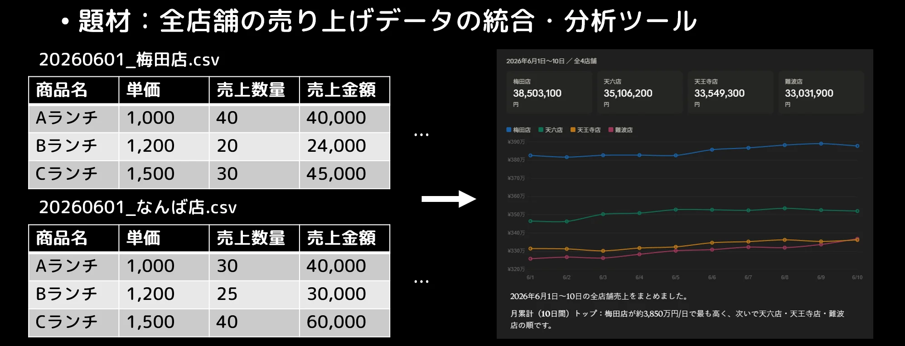
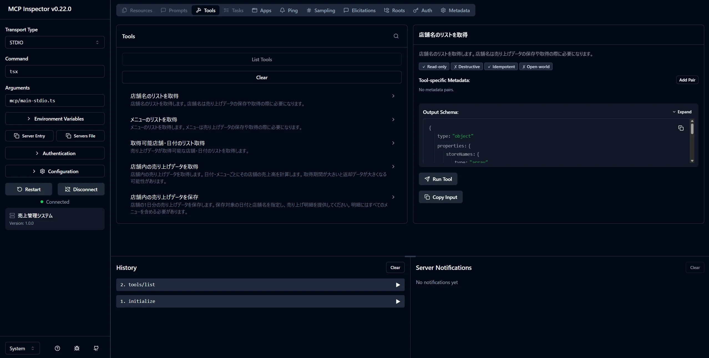
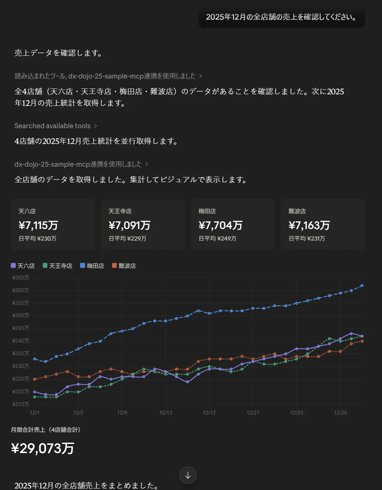

# 店舗売上データ管理用 MCP サンプルコード



このプロジェクトは、CSV で管理している店舗売上データを MCP サーバー経由で「取得・集計・保存」できるようにしたサンプルです。

## 必要な環境

- Node.js 20 以降
  - npm, npx コマンドが使えること
- MCPクライアント (Claude Desktop など)

## セットアップ方法

このリポジトリをクローンします。

```bash
git clone https://github.com/eXpresser-UXM/20260617-dx-dojo-mcp-server-sample.git
```

関連する依存関係をインストールします。このプロジェクトルートをカレントディレクトリにして、下記コマンドを実行します。

```bash
npm install
```

MCPサーバーが正しくツールを提供できているかを確認するため、下記コマンドでインスペクタを動かします。

```bash
npm run inspect
```

インスペクタを起動すると、ブラウザが起動します。 \
左側ペインの ▷Connect をクリックします。 \
MCPサーバーに接続されると、右側ペインに「売上管理システム」に接続したことが表示されます。 \
上部からToolsをクリックし、List Tools をクリックすると、このMCPサーバーが提供しているツールの一覧が表示されます。



ターミナルに戻り、インスペクタを停止します。

MCPクライアントのMCPサーバー接続設定で、売上管理データに接続できるように構成します。

以下は、Claude Desktop の例 (claude_desktop_config.json) です。

``` json
{
  "mcpServers": {
    "dx-dojo-sample-mcp": {
      "command": "npx",
      "args": [
        "-y",
        "tsx",
        "/path/to/this/project/mcp/main-stdio.ts"
      ]
    },
    # other MCP server configurations...
  },
  # other configurations...
}
```

MCPクライアントを再起動して、売上管理システムに接続するようなプロンプトを実行します。
例えば以下の通りです。

```prompt
2025年12月の全店舗の売上を確認してください。
```

実行すると以下のようなイメージで、MCPサーバーから売上データが返ってきます。



## 全体像（まずここだけ押さえれば OK）

- MCP サーバーを立ち上げる
- 売上データを扱うツールを登録する
- 利用側（AI やクライアント）がそのツールを呼ぶ
- データは storage フォルダ内の CSV を読む/書く

処理の入口は mcp/main-stdio.ts です。
ツールの束ね役は mcp/mcp-server.ts です。
個別機能は mcp/tools 配下にあります。

---

## 1. 共通ユーティリティ

### mcp/lib.ts

このファイルは「土台」を定義しています。

- 何をしているか
  - ツール登録用の型（RegisterTool）
  - プロンプト登録用の型（RegisterPrompt）
  - リソース登録用の型（RegisterResource）
  をまとめて定義しています。

- なぜ大事か
  - 各ツールファイルで同じ型定義を毎回書かなくて済み、コードの見通しがよくなります。

- projectRoot について
  - 実行中ファイルの場所から、プロジェクトルートを計算して export しています。
  - これで「どこから実行しても storage フォルダを見つけやすい」作りになっています。

---

## 2. サーバー起動エントリ

### mcp/main-stdio.ts

このファイルは「MCP サーバーを実際に起動する」役目です。

- 何をしているか
  1. getServer でサーバーインスタンスを作る
  2. StdioServerTransport を作る
  3. connect して待ち受け開始

- エラーハンドリング
  - 起動に失敗したらエラーを表示し、終了コード 1 でプロセス終了します。
  - ハンズオンで「起動できた/できない」がすぐ分かるシンプル設計です。

---

## 3. サーバー組み立て

### mcp/mcp-server.ts

このファイルは「どの機能を提供するか」を 1 か所で宣言しています。

- 何をしているか
  1. McpServer を名前・説明・バージョン付きで作成
  2. ツールを順番に登録
  3. プロンプトを登録
  4. 完成したサーバーを返す

- 登録される機能
  1. 利用可能日付一覧
  2. 生データ取得
  3. 日別集計
  4. 商品別集計
  5. 日次売上保存
  6. 対話入力アシスタント（プロンプト）

---

## 4. ツール: 取得可能日付一覧

### mcp/tools/list-available-date.ts

このツールは「どの店舗の、どの日付データがあるか」を一覧で返します。

- 入力
  - なし

- 処理の流れ
  1. storage 配下のファイル一覧を取得
  2. CSV だけ対象にする
  3. ファイル名を 日付_店舗名.csv として分解
  4. 店舗ごとに日付配列へまとめる
  5. JSON で返す

- 返す内容
  - 店舗名ごとに、取得可能な日付の配列を返します。
  - 「まず何があるか確認する」ための最初の一歩に使うツールです。

---

## 5. ツール: 売上生データ取得

### mcp/tools/get-sales-rowdata.ts

このツールは「指定店舗・指定期間の明細データ」をそのまま近い形で返します。

- 入力
  1. storeName
  2. from（YYYYMMDD）
  3. to（YYYYMMDD）

- 処理の流れ
  1. 文字列日付を Date に変換
  2. from が to より後ならエラー返却
  3. 期間内の日付リストを 1 日ずつ作成
  4. 日付ごとに CSV を読み込み
  5. 各行を次の形に変換
     - メニュー名
     - 単価
     - 数量
     - 金額
  6. 存在しないファイル（ENOENT）は「その日はデータなし」としてスキップ

- ポイント
  - Promise.all で日付ごと読み込みを並列化しており、期間が長くても効率よく取れる設計です。

---

## 6. ツール: 日別統計

### mcp/tools/get-sales-statistics-perdate.ts

このツールは「日ごとの合計」を返します。

- 入力
  - storeName, from, to

- 出力
  - 日付ごとに次の値を返します。
    1. totalAmount（売上合計）
    2. totalQuantity（数量合計）
    3. averageUnitPrice（平均単価）

- 処理の流れ
  - 生データ取得ツールと似ていますが、違いは「CSV 行を返すのではなく合計値を計算する」点です。

- 補足
  - CSV ヘッダ表記ゆれ（例: 売上金額 と 売上金額 (円)）の両方に対応していて、現場データの揺れに少し強いです。

---

## 7. ツール: 商品別統計

### mcp/tools/get-sales-statistics-peritem.ts

このツールは「期間全体で商品ごとに集計」します。

- 入力
  - storeName, from, to

- 出力
  - 商品ごとに次の値を返します。
    1. totalAmount
    2. totalQuantity
    3. averageUnitPrice

- 処理の流れ
  1. 期間の日付を作る
  2. 日ごと CSV を読む
  3. 商品名をキーに Map で加算
  4. 最後に配列化して、日本語ロケールで商品名ソート

- 使いどころ
  - 「何がどれだけ売れたか」を見るのに最適です。
  - 日別ではなく、商品軸で傾向を見たい時に使います。

---

## 8. ツール: 日次売上保存

### mcp/tools/save-daily-sales.ts

このツールは「1 日分の売上明細を CSV として保存」します。

- 入力
  1. storeName
  2. date（YYYYMMDD）
  3. sales（メニュー名・単価・数量）

- 処理の流れ
  1. sales が空ならエラー
  2. 金額を 単価 × 数量 で計算
  3. 日本語ヘッダ付き CSV 文字列を作成
  4. storage/date_store.csv へ書き込み
  5. 保存内容を JSON で返却

- ハンズオン的な見どころ
  - 最終的に「ファイルとして残る」ので、入力系の体験が分かりやすいです。
  - AI 対話から確定したデータを永続化する、実務っぽい流れを学べます。

---

## 9. プロンプト: 売上入力アシスタント

### mcp/tools/register-sales-assistant.ts

このファイルはツールではなく「対話シナリオ」を登録しています。
AI に、売上入力時の会話手順を守らせるための説明書です。

- 何をしているか
  1. 店舗名を引数に受ける
  2. AI に対して長文の手順指示を渡す
  3. 手順に沿って次を対話で進めるよう誘導
     - 既存データ確認
     - 入力漏れ確認
     - 追加メニュー確認
     - 最終確認
     - 保存

- このファイルの価値
  - 「ただツールを呼ぶ」だけでなく、「どう会話するか」を設計している点が非常にハンズオン向きです。
  - 非エンジニアでも、AI アシスタントの挙動を読み解きやすくなります。

---

## 10. このサンプルの学びポイント（非エンジニア向け）

1. ツール設計の基本
   - 入力と出力を最初に定義すると、処理がぶれにくくなります。

2. データ処理の基本
   - CSV を読む → 必要な形に整える → 集計する、という流れがそのまま見えます。

3. 対話設計の基本
   - プロンプトで手順を定義すると、AI の振る舞いを安定させやすいです。

4. エラー対応の基本
   - 期間不正やファイル未存在を想定して、壊れにくくしています。

---

興味のある方は、まず mcp/main-stdio.ts と mcp/mcp-server.ts を読んでから、mcp/tools 配下を 1 ファイルずつ追っていくと理解しやすいです。
